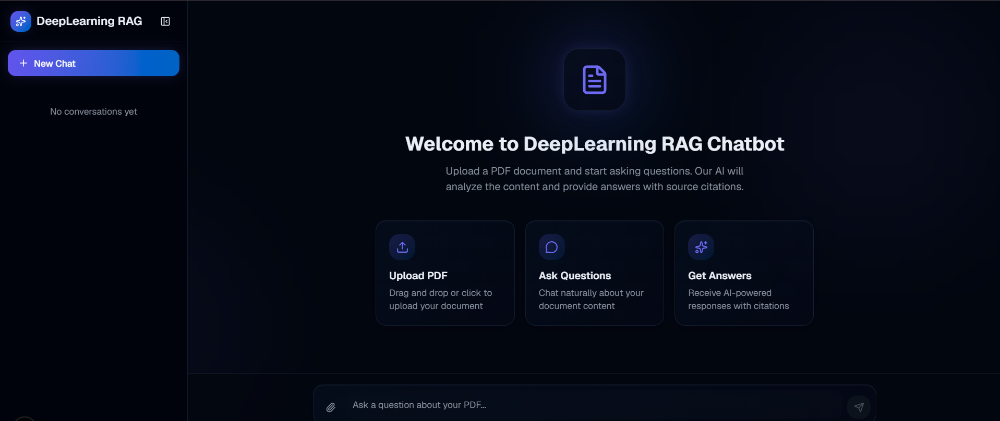
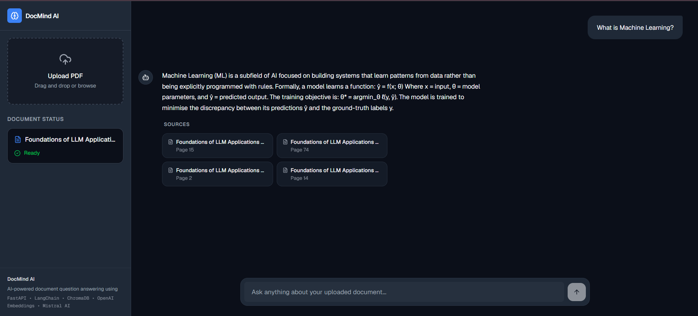
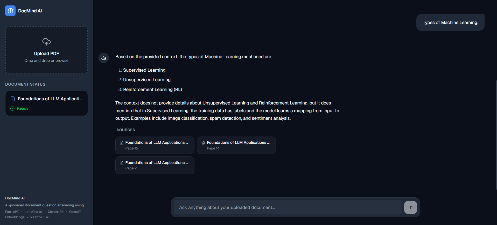

# 🚀 DocMind AI

An AI-powered document question answering application built using **FastAPI**, **LangChain**, **ChromaDB**, **OpenAI Embeddings**, **Mistral AI**, and **Next.js**.

DocMind AI allows users to upload a PDF and ask natural language questions about its contents. It uses a Retrieval-Augmented Generation (RAG) pipeline to retrieve relevant document chunks and generate grounded answers with source citations.

---

# 🌐 Live Demo

### Frontend

https://YOUR_VERCEL_URL

### Backend API

https://YOUR_RENDER_URL/docs

---

# 📸 Screenshots







---

# ✨ Features

- 📄 Upload your own PDF documents
- 🤖 AI-powered document question answering
- 🔍 Semantic search using OpenAI Embeddings
- 📚 ChromaDB Vector Database
- 🧠 Retrieval-Augmented Generation (RAG)
- 📍 Source citations with page numbers
- ⚡ FastAPI REST API
- 🎨 Modern responsive Next.js frontend
- 🌙 Clean professional dark UI
- ☁️ Cloud deployment (Render + Vercel)
- ❌ Prevents hallucinations by answering only from uploaded documents

---

# 🏗️ System Architecture

```
                User Uploads PDF
                        │
                        ▼
                PyPDFLoader
                        │
                        ▼
     RecursiveCharacterTextSplitter
                        │
                        ▼
          OpenAI Embeddings Model
                        │
                        ▼
                  ChromaDB
                        │
                        ▼
                MMR Retriever
                        │
                        ▼
      Prompt + Retrieved Context
                        │
                        ▼
                 Mistral AI
                        │
                        ▼
     Answer + Source Citations
```

---

# ⚙️ Tech Stack

## Backend

- Python
- FastAPI
- LangChain
- ChromaDB
- OpenAI Embeddings (`text-embedding-3-small`)
- Mistral AI
- PyPDFLoader

## Frontend

- Next.js
- React
- TypeScript
- Tailwind CSS
- shadcn/ui

## Deployment

- Render
- Vercel

---

# 📂 Project Structure

```
DocMind-AI/

├── backend/
│
├── frontend/
│
├── sample_documents/
│      Foundations_of_Generative_AI_and_RAG.pdf
│
├── screenshots/
│
└── README.md
```

---

# 🚀 Local Setup

## Clone Repository

```bash
git clone https://github.com/YOUR_USERNAME/DocMind-AI.git

cd DocMind-AI
```

---

## Backend

```bash
cd backend

python -m venv .venv
```

Windows

```bash
.venv\Scripts\activate
```

Install dependencies

```bash
pip install -r requirements.txt
```

Create `.env`

```env
OPENAI_API_KEY=YOUR_KEY

MISTRAL_API_KEY=YOUR_KEY
```

Run

```bash
uvicorn api:app --reload
```

Swagger UI

```
http://127.0.0.1:8000/docs
```

---

## Frontend

```bash
cd frontend

npm install
```

Create

```
.env.local
```

```env
NEXT_PUBLIC_API_URL=http://127.0.0.1:8000
```

Run

```bash
npm run dev
```

---

# 📌 API Endpoints

## Upload Document

```
POST /upload
```

Uploads and indexes a PDF into the vector database.

---

## Chat

```
POST /chat
```

Returns

```json
{
    "answer": "...",
    "sources": [
        {
            "page": 4,
            "source": "sample.pdf"
        }
    ]
}
```

---

# 📄 Sample Knowledge Base

A professionally written AI reference document is included to quickly test the application.

Location:

```
sample_documents/
└── Foundations_of_Generative_AI_and_RAG.pdf
```

The document covers:

- Artificial Intelligence
- Machine Learning
- Deep Learning
- Transformers
- Large Language Models
- Embeddings
- Vector Databases
- Retrieval-Augmented Generation (RAG)
- Real-world Applications
- Future of AI

Simply upload the PDF and begin asking questions.

---

# 🧪 Sample Questions

## Artificial Intelligence

- What is Artificial Intelligence?
- Explain the history of AI.
- What are the applications of AI?

## Machine Learning

- What is Machine Learning?
- What are the three types of Machine Learning?
- Explain supervised learning.
- Explain reinforcement learning.

## Deep Learning

- What is Deep Learning?
- Explain CNNs.
- Explain RNNs.
- Why are Transformers important?

## Large Language Models

- What is an LLM?
- What are Tokens?
- What is a Context Window?
- Explain Prompt Engineering.
- What are Hallucinations?

## Retrieval-Augmented Generation (RAG)

- What is RAG?
- Explain the RAG pipeline.
- Why is Chunking important?
- What happens during Retrieval?
- How does RAG reduce hallucinations?

---


# 💡 Engineering Highlights

This project was built with a focus on production-oriented RAG architecture.

Highlights include:

- Dynamic PDF upload and indexing
- Semantic retrieval using MMR
- Grounded AI responses
- Source citations with page numbers
- Modular backend architecture
- Environment-based configuration
- Responsive frontend
- Independent frontend and backend deployment

---

# 🚧 Current Limitations

Current version supports:

- Single active document per session
- Text-based PDFs only

Planned improvements:

- OCR support for scanned PDFs
- Multi-document retrieval
- User authentication
- Per-user vector databases
- Persistent chat history
- Streaming responses
- Background document processing
- Hybrid Search
- Reranking Pipeline

---

# 👨‍💻 Author

**Rishabh Rajput**

LinkedIn

(Add LinkedIn URL)

---

If you found this project useful, consider giving it a ⭐ on GitHub.